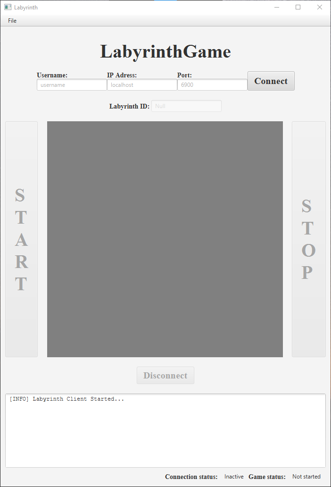
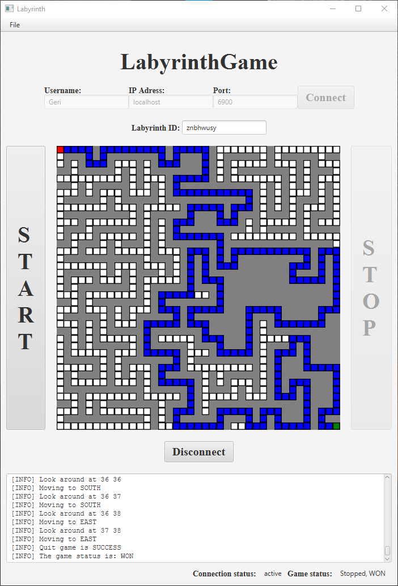
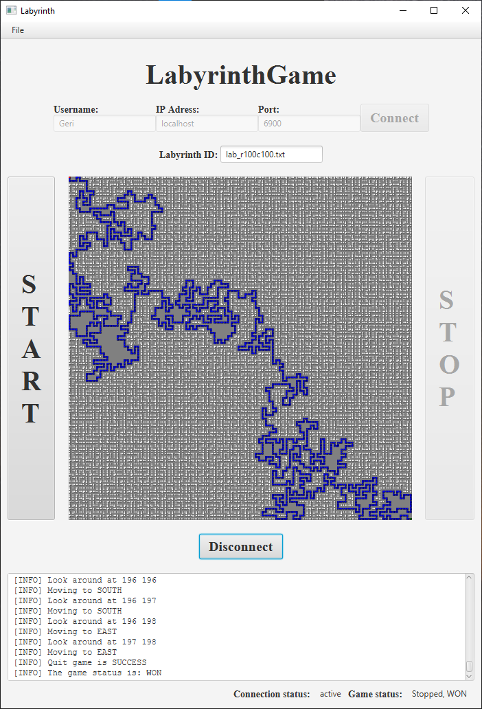
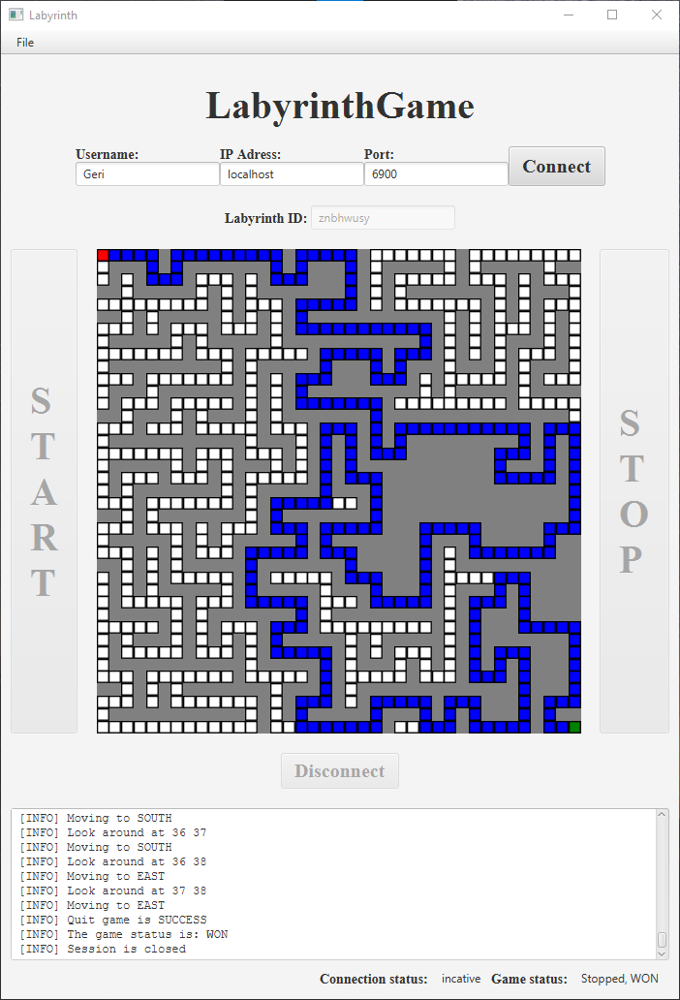

# LabyrinthSolver
The problem was that we got an API and the implementation of the server. We had to create a Client which can find the way out from a labyrinth using the API (over localhost).
We had to solve the labyrinth with always requesting the information about the current position and update our path based on the incoming data. My solution is not deterministic because it chooses path from unknowns randomly.
To make it work you should install JavaFX (version 11.0.2 is tested with JDK 17).

# Pictures of the working program:
- At the beginning you have to connect to the server with a username, hostname and port, defaults are used if nothing provided.

- The result of the solution, a log widget and the visualization of the labyrinth can be seen:

- The solver can deal with big labyrinths as well (takes a bit more time):

- You can disconnect and reconnect if you want:
  

